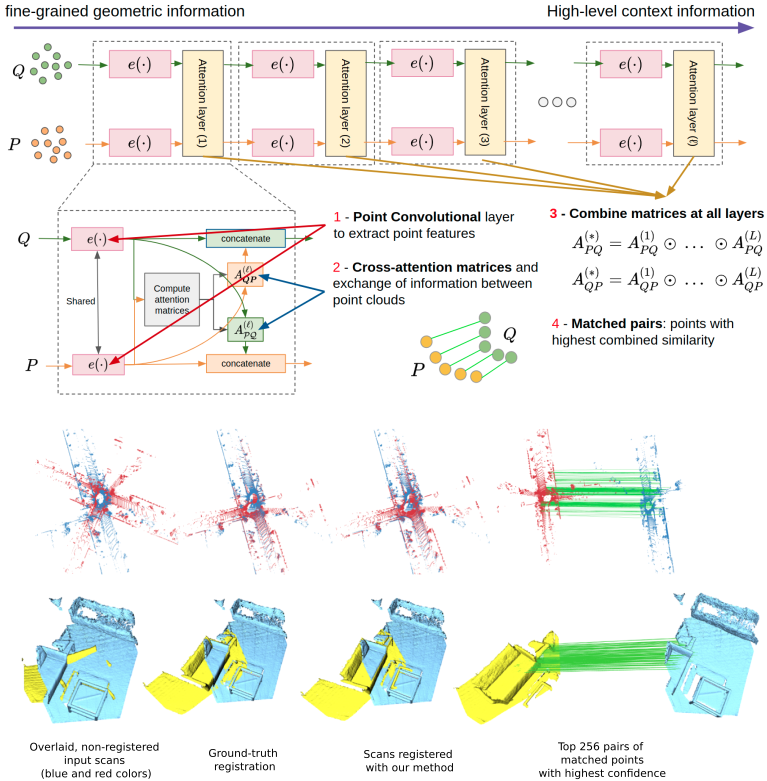

# PCAM: Product of Cross-Attention Matrices for Rigid Registration of Point Clouds

[](https://paperswithcode.com/sota/point-cloud-registration-on-3dmatch-at-least-1?p=pcam-product-of-cross-attention-matrices-for)
[](https://paperswithcode.com/sota/point-cloud-registration-on-kitti-fcgf?p=pcam-product-of-cross-attention-matrices-for)

[**PCAM: Product of Cross-Attention Matrices for Rigid Registration of Point Clouds**](http://arxiv.org/abs/2110.01269)  
[*Anh-Quan Cao*<sup>1,2</sup>](https://anhquancao.github.io),
[*Gilles Puy*<sup>1</sup>](https://sites.google.com/site/puygilles/home),
[*Alexandre Boulch*<sup>1</sup>](http://boulch.eu),
[*Renaud Marlet*<sup>1,3</sup>](http://imagine.enpc.fr/~marletr/)  
<sup>1</sup>*valeo.ai, France and <sup>2</sup>Inria, France and <sup>3</sup>ENPC, France*

If you find this code or work useful, please cite our [paper](http://arxiv.org/abs/2110.01269) and [give us a star](https://github.com/valeoai/PCAM/stargazers):
```
@inproceedings{cao21pcam,
  title={{PCAM}: {P}roduct of {C}ross-{A}ttention {M}atrices for {R}igid {R}egistration of {P}oint {C}louds},
  author={Cao, Anh-Quan and Puy, Gilles and Boulch, Alexandre and Marlet, Renaud},
  booktitle={International Conference on Computer Vision (ICCV)},
  year={2021},
}
```



## Preparation

### Installation

1. This code was implemented with python 3.7, pytorch 1.6.0 and CUDA 10.2. Please install [PyTorch](https://pytorch.org/). 
```
pip install torch==1.6.0 torchvision==0.7.0
```

2. A part of the code (voxelisation) is using MinkowskiEngine 0.4.3. Please install it on your system.
```
sudo apt-get update
sudo apt install libgl1-mesa-glx
sudo apt install libopenblas-dev g++-7
export CXX=g++-7 
pip install -U MinkowskiEngine==0.4.3 --install-option="--blas=openblas" -v
```

4. Clone this repository and install the additional dependencies:
```
$ git clone https://github.com/valeoai/PCAM.git
$ cd PCAM/
$ pip install -r requirements.txt
```

5. Install lightconvpoint [5], which is an early version of [FKAConv](https://github.com/valeoai/FKAConv):
```
$ pip install -e ./lcp
```

6. Finally, install pcam:
```
$ pip install -e ./
```
You can edit pcam's code on the fly and import function and classes of pcam in other project as well.


### Datasets


#### 3DMatch and KITTI

Follow the instruction on [DGR github repository](https://github.com/chrischoy/DeepGlobalRegistration#3dmatch) to download both datasets.  

Place 3DMatch in the folder `/path/to/pcam/data/3dmatch/`, which should have the structure described [here](./pcam/data/3dmatch/3dmatch.md).

Place KITTI in the folder `/path/to/pcam/data/kitti/`, which should have the structure described [here](./pcam/data/kitti/kitti.md).

You can create soft links with the command `ln -s` if the datasets are stored somewhere else on your system.  

For these datasets, we use the same dataloaders as in [DGR](https://github.com/chrischoy/DeepGlobalRegistration#3dmatch) [1-3], up to few modifications for code compatibility.


#### Modelnet40

Download the dataset [here](https://shapenet.cs.stanford.edu/media/modelnet40_ply_hdf5_2048.zip) and unzip it in the folder `/path/to/pcam/data/modelnet/`, which should have the structure described [here](./pcam/data/modelnet/modelnet.md).

Again, you can create soft links with the command `ln -s` if the datasets are stored somewhere else on your system.

For this dataset, we use the same dataloader as in [PRNet](https://github.com/WangYueFt/prnet) [4], up to few modifications for code compatibility.


### Pretrained models
Download PCAM pretrained models [here](https://github.com/valeoai/PCAM/releases/download/v0.1/trained_models.zip) and unzip the file in the folder `/path/to/pcam/trained_models/`, which should have the structure described [here](./pcam/trained_models/models.md).


## Testing PCAM

As we randomly subsample the point clouds in PCAM, there are some slight variations from one run to another. In our paper, we ran 3 independent evaluations on the complete test set and averaged the scores.

### 3DMatch

We provide two different pre-trained models for 3DMatch: one for PCAM-sparse and one for PCAM-soft, both trained using 4096 input points.

To test the PCAM-soft model, type:
```bash
$ cd /path/to/pcam/scripts/
$ python eval.py with ../configs/3dmatch/soft.yaml
```

To test the PCAM-sparse model on the test set of , type:
```bash
$ cd /path/to/pcam/scripts/
$ python eval.py with ../configs/3dmatch/sparse.yaml
``` 
 
#### Optional

As in DGR [1], the results can be improved using different levels of post-processing.

1. Keeping only the pairs of points with highest confidence score (the threshold was optimised on the validation set of 3DMatch). 
```bash
$ cd /path/to/pcam/scripts/
$ python eval.py with ../configs/3dmatch/soft_filter.yaml
$ python eval.py with ../configs/3dmatch/sparse_filter.yaml
```

2. Using in addition the refinement by optimisation proposed by DGR [1].
```bash
$ cd /path/to/pcam/scripts/
$ python eval.py with ../configs/3dmatch/soft_refinement.yaml
$ python eval.py with ../configs/3dmatch/sparse_refinement.yaml
```

3. Using as well the safeguard proposed by DGR [1].
```bash
$ cd /path/to/pcam/scripts/
$ python eval.py with ../configs/3dmatch/soft_safeguard.yaml
$ python eval.py with ../configs/3dmatch/sparse_safeguard.yaml
```
*Note:* For a fair comparison, we fixed the safeguard condition so that it is applied on the same proportion of scans as in DGR [1].


### KITTI

We provide two different pre-trained models for KITTI: one for PCAM-sparse and one for PCAM-soft, both trained using 2048 input points.

To test the PCAM-soft model, type:
```bash
$ cd /path/to/pcam/scripts/
$ python eval.py with ../configs/kitti/soft.yaml
```

To test the PCAM-sparse model, type:
```bash
$ cd /path/to/pcam/scripts/
$ python eval.py with ../configs/kitti/sparse.yaml
```
 
#### Optional 
As in DGR [1], the results can be improved by refining the results using ICP.
```bash
$ cd /path/to/pcam/scripts/
$ python eval.py with ../configs/kitti/soft_icp.yaml
$ python eval.py with ../configs/kitti/sparse_icp.yaml 
```

### ModelNet40

There exist 3 different variants of this dataset. Please refer to [4] for the construction of these variants.

#### Unseen objects

To test the PCAM models, type:
```bash
$ cd /path/to/pcam/scripts/
$ python eval.py with ../configs/modelnet/soft.yaml
$ python eval.py with ../configs/modelnet/sparse.yaml
```
 
#### Unseen categories

To test the PCAM models, type:
```bash
$ cd /path/to/pcam/scripts/
$ python eval.py with ../configs/modelnet/soft_unseen.yaml
$ python eval.py with ../configs/modelnet/sparse_unseen.yaml
```

#### Unseen objects with noise

To test the PCAM models, type:
```bash
$ cd /path/to/pcam/scripts/
$ python eval.py with ../configs/modelnet/soft_noise.yaml
$ python eval.py with ../configs/modelnet/sparse_noise.yaml
```


## Training

The models are saved in the folder `/path/to/pcam/trained_models/new_training/{DATASET}/{CONFIG}`, where `{DATASET}` is the name of the dataset and `{CONFIG}` give a description of the PCAM architecture and the losses used for training.

### 3DMatch

To train a PCAM-soft model, type:
```bash
$ cd /path/to/pcam/scripts/
$ python train.py with ../configs/3dmatch/soft.yaml
```

You can then test this new model by typing:
```bash
$ python eval.py with ../configs/3dmatch/soft.yaml PREFIX='new_training'
```

To train a PCAM-sparse model, type:
```bash
$ cd /path/to/pcam/scripts/
$ python train.py with ../configs/3dmatch/sparse.yaml
```

Training took about 12 days on a Nvidia Tesla V100S-32GB.

You can then test this new model by typing:
```bash
$ python eval.py with ../configs/3dmatch/sparse.yaml PREFIX='new_training'
``` 

### KITTI

To train PCAM models, type:
```bash
$ cd /path/to/pcam/scripts/
$ python train.py with ../configs/kitti/soft.yaml
$ python train.py with ../configs/kitti/sparse.yaml
```

Training took about 1 day on a Nvidia GeForce RTX 2080 Ti.

You can then test these new models by typing:
```bash
$ python eval.py with ../configs/kitti/soft.yaml PREFIX='new_training'
$ python eval.py with ../configs/kitti/sparse.yaml PREFIX='new_training'
```

### ModelNet

Training PCAM on ModelNet took about 10 hours on Nvidia GeForce RTX 2080.

#### Unseen objects

To train PCAM models, type:
```bash
$ cd /path/to/pcam/scripts/
$ python train.py with ../configs/modelnet/soft.yaml NB_EPOCHS=10
$ python train.py with ../configs/modelnet/sparse.yaml NB_EPOCHS=10
```

You can then test these new models by typing:
```bash
$ python eval.py with ../configs/modelnet/soft.yaml PREFIX='new_training'
$ python eval.py with ../configs/modelnet/sparse.yaml PREFIX='new_training'
```

#### Unseen categories

To train PCAM models, type:
```bash
$ cd /path/to/pcam/scripts/
$ python train.py with ../configs/modelnet/soft_unseen.yaml NB_EPOCHS=10
$ python train.py with ../configs/modelnet/sparse_unseen.yaml NB_EPOCHS=10
```

You can then test these new models by typing:
```bash
$ python eval.py with ../configs/modelnet/soft_unseen.yaml PREFIX='new_training'
$ python eval.py with ../configs/modelnet/sparse_unseen.yaml PREFIX='new_training'
```

#### Unseen objects with noise

To train PCAM models, type:
```bash
$ cd /path/to/pcam/scripts/
$ python train.py with ../configs/modelnet/soft_noise.yaml NB_EPOCHS=10
$ python train.py with ../configs/modelnet/sparse_noise.yaml NB_EPOCHS=10
```

You can then test these new models by typing:
```bash
$ python eval.py with ../configs/modelnet/soft_noise.yaml PREFIX='new_training'
$ python eval.py with ../configs/modelnet/sparse_noise.yaml PREFIX='new_training'
``` 


## References

[1] Christopher Choy, Wei Dong, Vladlen Koltun. Deep Global Registration, CVPR, 2020.

[2] Christopher Choy, Jaesik Park, Vladlen Koltun. Fully Convolutional Geometric Features. ICCV, 2019.
  
[3] Christopher Choy, JunYoung Gwak, Silvio Savarese. 4D Spatio-Temporal ConvNets: Minkowski Convolutional 
Neural Networks. CVPR, 2019.

[4] Yue Wang and Justin M. Solomon. PRNet: Self-Supervised Learning for Partial-to-Partial Registration. NeurIPS, 2019.

[5] Alexandre Boulch, Gilles Puy, Renaud Marlet. FKAConv: Feature-Kernel Alignment for Point Cloud Convolution. ACCV, 2020.


## License
PCAM is released under the [Apache 2.0 license](./LICENSE).
